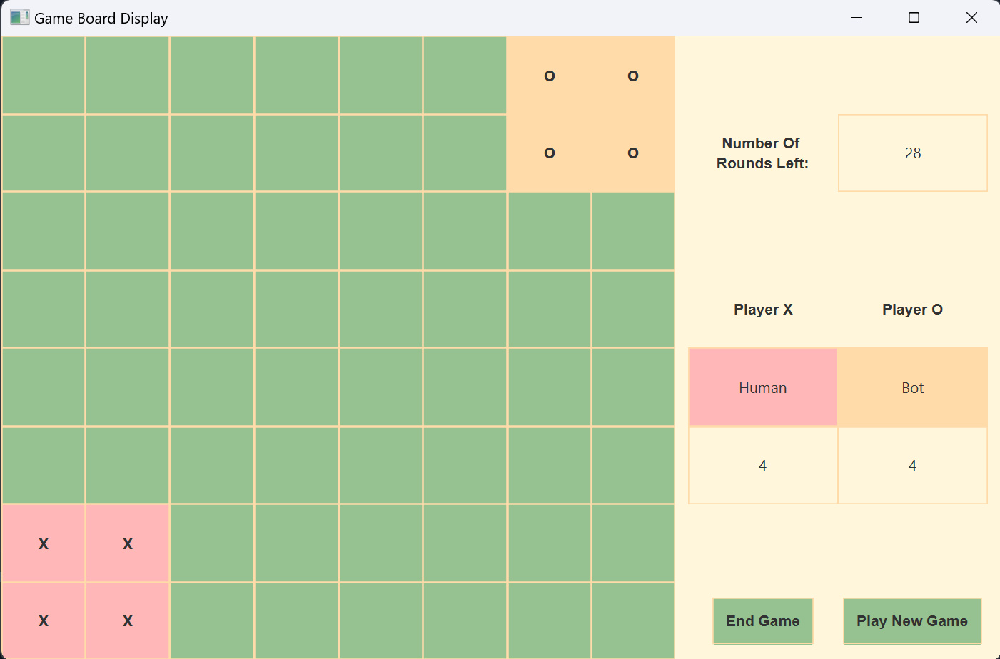

# Adversarial Adjacency-Strategy-Game
> Tugas Kecil 1 IF3170 Inteligensi Buatan



## Table of Contents
1. [General Information](#general-information)
2. [Features](#features)
3. [Technologies Used](#technologies-used)
4. [Usage](#usage)
5. [Project Status](#project-status)
6. [Acknowledgements](#acknowledgements)
7. [Author](#author)

# General Information
Program ini merupakan program permainan Adjacency-Strategy-Game yang telah dibuat dan kelompok menambahkan algoritma bot sebagai implementasi dari materi kuliah IF3170 Inteligensi Buatan, yaitu algoritma minimax alpha beta pruning serta algoritma hill-climbing.

## Features
Fitur tambahan yang dibuat kelompok serta dapat digunakan pada program ini adalah:
- Menggunakan bot dengan algoritma minimax alpha beta pruning sebagai lawan bermain
- Menggunakan bot dengan algoritma hill-climbing sebagai lawan bermain

## Technologies Used
- Java Versi 11
- Library javafx

## Usage
Terdapat beberapa cara untuk menjalankan program:
- Menggunakan Make
```
make run
```
- Menggunakan runner
```
./run.bat
```
- Compile manual menggunakan terminal
```
javac -cp ./src --module-path "./javafx-sdk/lib" --add-modules=javafx.controls,javafx.fxml src/*.java
java -cp ./src --module-path "./javafx-sdk/lib" --add-modules=javafx.controls,javafx.fxml Main
```

## Project Status
On going

## Acknowledgements
- Program ini dibuat untuk mendukung pengerjaan Tugas Kecil 1 IF3170 Inteligensi Buatan
- Terima kasih kepada Dosen serta Asisten yang telah mengampu Mata Kuliah Tugas Kecil 1 IF3170 Inteligensi Buatan

## Author
| NIM | Nama |
|:---:|:----:|
|13521006| Azmi Hasna Zahrani|
|13521024| Ahmad Nadil|
